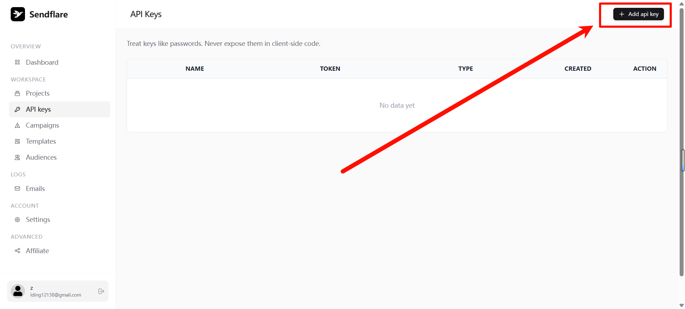
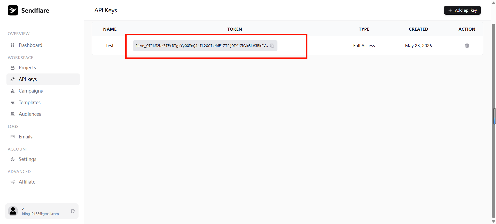
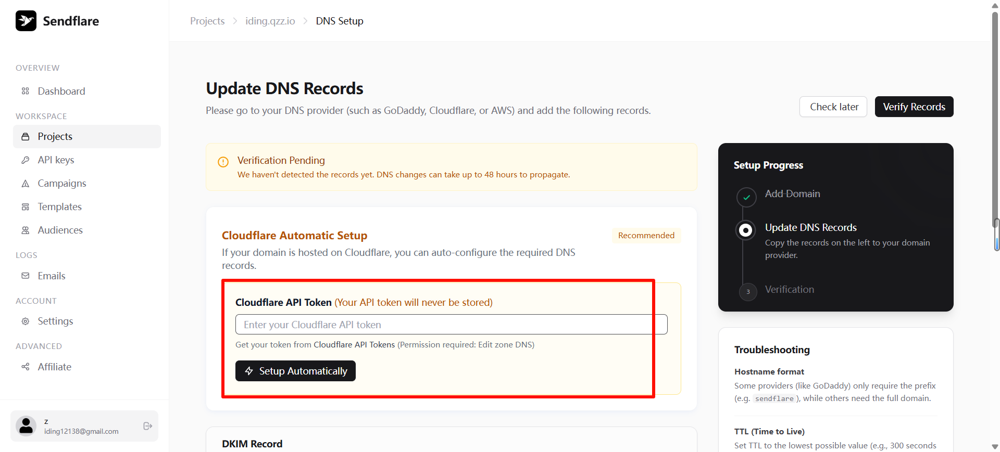
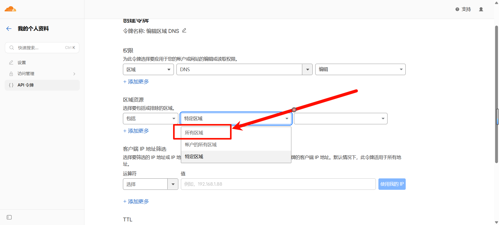
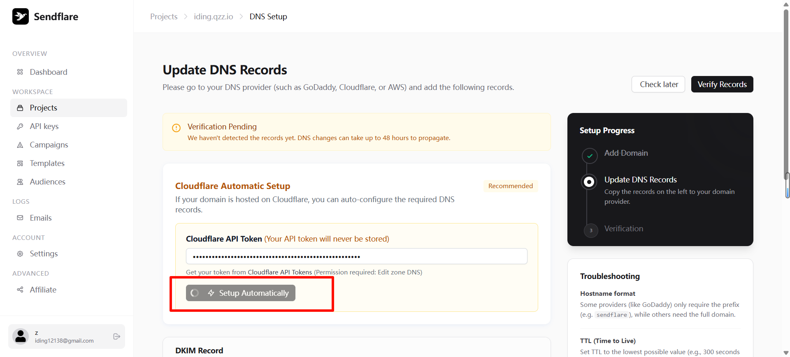
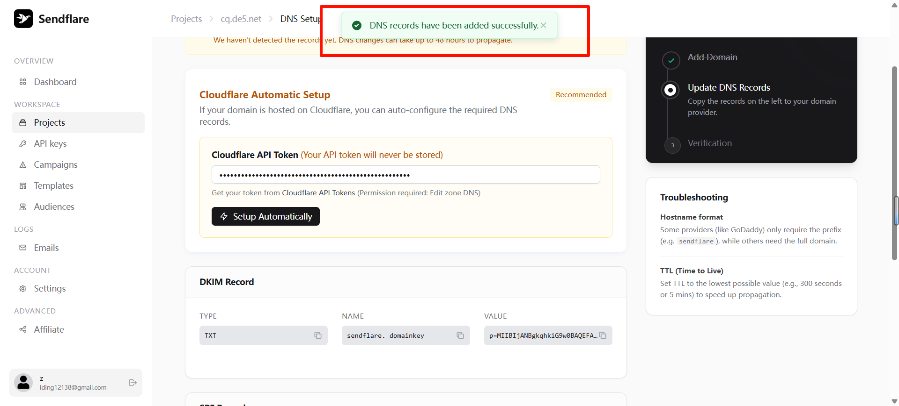
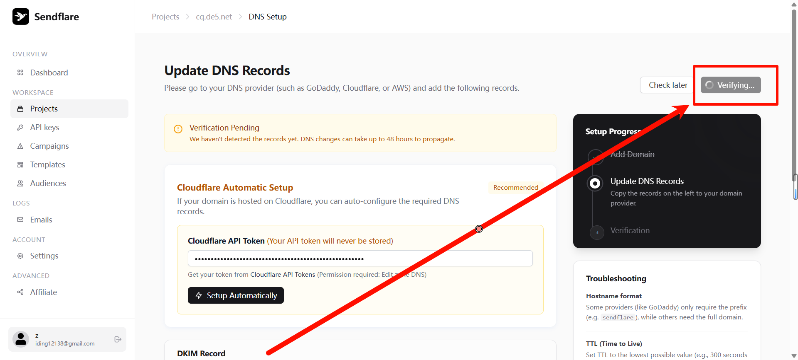
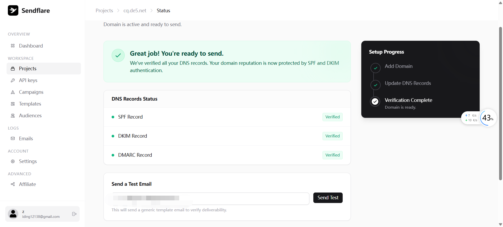

# 使用 SendFlare 发送邮件（密钥获取与配置教程）

本项目支持通过 SendFlare 提供的 API 进行发件（发件箱）。本文档介绍从申请密钥、绑定域名到在 Cloudflare Workers 中配置的完整流程。

> 环境变量使用 `SENDFLARE_API_KEY`，配置方式与 Resend 一致，支持单密钥、键值对和 JSON 三种格式。

## 1. 在 SendFlare 创建 API Key

登录 [SendFlare](https://sendflare.com/)，左侧菜单进入 **API keys**，点击 **+ Add api key**：



创建成功后复制生成的 Token 并妥善保存：



> 该 Token 仅显示一次，请务必妥善保管。

## 2. 在 SendFlare 绑定并验证发信域名

SendFlare 支持通过 Cloudflare API Token 自动配置 DNS 记录（SPF、DKIM、DMARC）。

### 2.1 创建 Cloudflare API Token

访问 [Cloudflare API Tokens](https://dash.cloudflare.com/profile/api-tokens)，点击 **+ 创建令牌**：



在模板列表中找到 **编辑区域 DNS**，点击 **使用模板**：


确认权限为「区域 DNS 编辑」：


区域资源选择 **所有区域**：



> 其他配置（IP 筛选、TTL 等）保持默认即可。

点击「继续以显示摘要」：


确认后点击「创建令牌」：


复制生成的 Cloudflare API Token：


> 此 Token 也只显示一次，请立即复制并妥善保存。

### 2.2 将 Cloudflare Token 填入 SendFlare 自动配置 DNS

回到 SendFlare 项目的 DNS Setup 页面，在 **Cloudflare Automatic Setup** 区域粘贴上一步的 Cloudflare API Token，点击 **Setup Automatically**：



等待 DNS 记录自动添加成功：



点击 **Verify Records** 验证 DNS 记录：



验证通过后，SPF、DKIM、DMARC 均显示 Verified，域名配置完成：



## 3. 在 Cloudflare Workers 配置变量

本项目运行在 Cloudflare Workers，需把密钥配置为 Secret。

方式一：命令行（Wrangler）

```bash
# 设置 SendFlare 密钥（Secret）
wrangler secret put SENDFLARE_API_KEY

# 设置普通变量（可写入 wrangler.toml 的 [vars]）
# 多域名用逗号分隔
# 例：MAIL_DOMAIN="iding.asia, example.com"
```

方式二：Dashboard（Git 集成部署常用）
- 进入 Cloudflare Dashboard → Workers → 选中你的 Worker → Settings → Variables。
- 在 Secrets 添加 `SENDFLARE_API_KEY`。
- 在 Variables 添加 `MAIL_DOMAIN`，值为你用于收取/发件的域名列表（需与 SendFlare 已验证域名一致）。

## 4. 关联项目并部署

```bash
# 本地开发
wrangler dev

# 正式部署
wrangler deploy
```

确保 `wrangler.toml` 已绑定 D1 数据库与静态资源（仓库已配置）。

## 5. 前端使用发件功能（发件箱）

- 在首页先生成或选择一个邮箱地址。
- 点击"发邮件"，填写收件人、主题与内容，点击发送。
- 后端会调用 SendFlare API 发出邮件，并在数据库记录，前端可在"发件箱"查看记录与详情。

注意：
- 发件地址为当前选中邮箱（形如 `xxx@你的域名`）。你的域名需在 SendFlare 已验证。
- 若返回 `未配置 SendFlare API Key`，说明没有设置或没有以 Secret 形式提供 `SENDFLARE_API_KEY`。

## 6. 常见问题

- 403/Unauthorized：域名未验证或 From 与已验证域名不一致。
- 429/限流：短时间大量请求，稍后重试或开启队列。
- 中文/HTML 内容：本项目会将 HTML 直接提交给 SendFlare，同时自动生成纯文本版本，提升兼容性。

## 7. 相关后端接口

- `POST /api/send` 发送单封邮件
- `GET /api/sent?from=xxx@domain` 获取发件记录列表
- `GET /api/sent/:id` 获取发件详情
- `DELETE /api/sent/:id` 删除发件记录

## 快速参考链接

- [SendFlare](https://sendflare.com/)
- [Cloudflare API Tokens](https://dash.cloudflare.com/profile/api-tokens)
